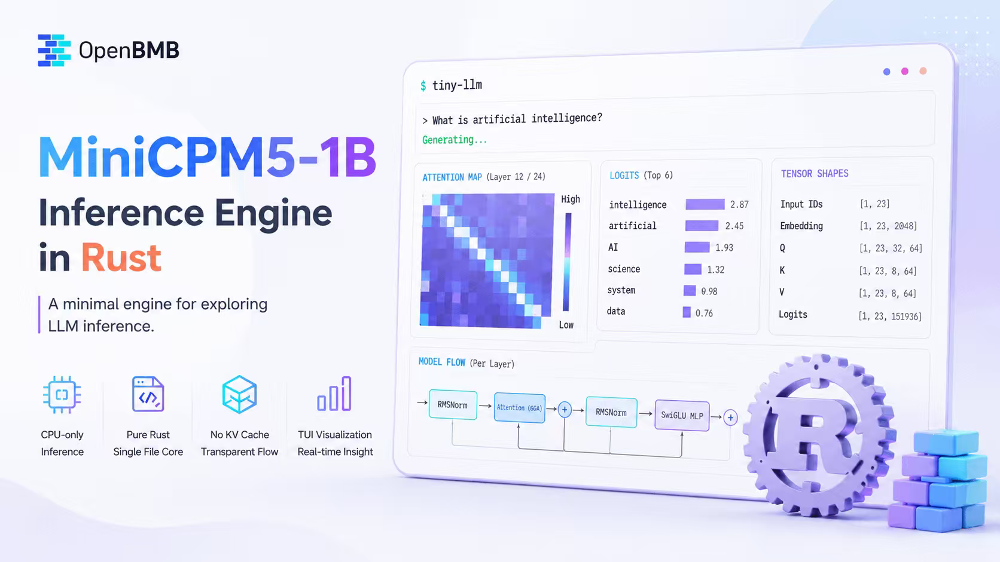
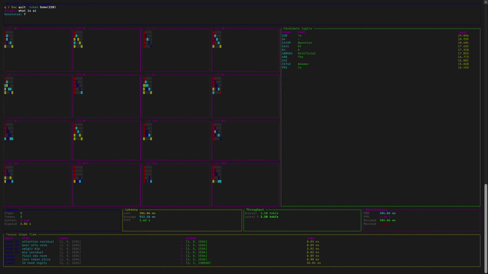

# tiny-llm

A minimal LLM inference engine for [MiniCPM5-1B](https://huggingface.co/openbmb/MiniCPM5-1B), built purely in Rust.

<p align="center">
  
</p>

<p align="center">
  
</p>

I built this project to study the fundamentals of large language models. Every understanding is rephrased directly in the code. My hope is that it helps you learn too.

This is also a preparation for integrating AI algorithms and technologies into my note app [OpenNote](https://github.com/opennote-org/opennote).

Inspired by [tiny-vllm](https://github.com/kuawo/tiny-llm). Coded with love. 💗

## Features

- **CPU-only inference** — no GPU required
- **No KV-cache** — focuses on the core model mechanics
- **TUI visualization** — real-time view of how the model "thinks"
- **Hand-written algorithms and tensor operations** - I hand written the algorithms and tensor ops. Thanks to `candle` for their tensor implementations. I learned a lot from their codebase.

### What's implemented

Below are the algorithms I implemented for tiny-llm:

| Component            | Details                                                 |
| -------------------- | ------------------------------------------------------- |
| Embedding            | Token ID lookup via embedding table                     |
| RoPE                 | Rotary position embeddings                              |
| Attention            | Multi-head attention with GQA (Grouped Query Attention) |
| MLP                  | SwiGLU activation function                              |
| Normalization        | RMSNorm                                                 |
| Residual connections | Standard skip connections after attention and MLP       |

Please refer to [algorithms.rs](./src/algorithms.rs) for codes.

For tensor operations, please refer to [tensors.rs](./src/tensors.rs).

The `main` branch contains my hand-written version of tiny-llm. If you would like to have a look at the one based on candle, please refer to `candle-based-implementation` branch.

For now, TinyTensor's performance is on par with that of `candle`. I have brief explanations of my optimizations to the inference engine here: [optimizations done & tried so far](./OPTIMIZATIONS.md)

## Getting Started

### 1. Download the model

```bash
# Download MiniCPM5-1B from HuggingFace
# Put the model files in a directory, e.g. ./models/minicpm5-1b/
# The directory should contain:
#   - config.json
#   - model-00000-of-00001.safetensors
#   - tokenizer.json
```

### 2. Build and run

```bash
cargo run --release -- "<model_dir>" "<your prompt>"
```

Example:

```bash
cargo run --release -- ./models/minicpm5-1b "What is artificial intelligence?"
```

Press `q` to quit early.

## Code Walkthrough

1. **`src/tensors.rs`** — The handwritten `TinyTensor` type and basic tensor operations.
2. **`src/algorithms.rs`** — LLM operations such as RMSNorm, RoPE, attention, and SwiGLU.
3. **`src/main.rs`** — Model loading and the `predict_next_token` inference flow.
4. **`src/tui.rs`** — The terminal UI, attention heatmaps, and candidate logits.
5. **`src/benchmark.rs`** — Live latency, throughput, and operation timing statistics.
6. **`src/simd.rs`** — SIMD optimizations to the tensor operations.
7. **`src/kv_cache.rs`** — KV cache for this minimal inference engine.
8. **`src/inference.rs`** — Main logics on model inferencing.

## License

MIT — see [LICENSE](LICENSE)
